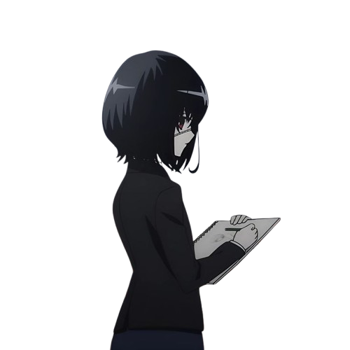

<table>
<tr>
<td width="220" align="center">
  
</td>
<td>

**「 Reverse engineer in the making 」**

18 · Germany 🇩🇪
Currently learning **C++** and getting into low-level stuff.

</td>
</tr>
</table>

